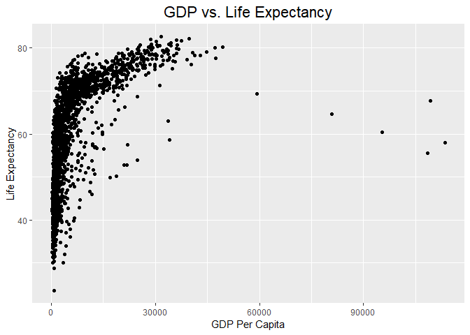

```r
library(tidyverse)
```

```
## -- Attaching packages -------------------------------------------------------------------------------------------------------- tidyverse 1.2.1 --
```

```
## v ggplot2 3.1.0     v purrr   0.2.5
## v tibble  1.4.2     v dplyr   0.7.8
## v tidyr   0.8.2     v stringr 1.3.1
## v readr   1.3.1     v forcats 0.3.0
```

```
## -- Conflicts ----------------------------------------------------------------------------------------------------------- tidyverse_conflicts() --
## x dplyr::filter() masks stats::filter()
## x dplyr::lag()    masks stats::lag()
```

```r
library(skimr)
```

```
## Warning: package 'skimr' was built under R version 3.5.3
```

```
## 
## Attaching package: 'skimr'
```

```
## The following object is masked from 'package:stats':
## 
##     filter
```

```r
library("RColorBrewer")
```

##Gapminder


```r
library(gapminder)
```

```
## Warning: package 'gapminder' was built under R version 3.5.3
```


```r
gapminder <- gapminder::gapminder
```

#1 Explore the data using the various function you have learned. Is it tidy, are there any NA's, what are its dimensions, what are the column names, etc.


```r
names(gapminder)
```

```
## [1] "country"   "continent" "year"      "lifeExp"   "pop"       "gdpPercap"
```


```r
gapminder %>% skimr::skim()
```

```
## Skim summary statistics
##  n obs: 1704 
##  n variables: 6 
## 
## -- Variable type:factor -------------------------------------------------------------------------------------------------------------------------
##   variable missing complete    n n_unique
##  continent       0     1704 1704        5
##    country       0     1704 1704      142
##                              top_counts ordered
##  Afr: 624, Asi: 396, Eur: 360, Ame: 300   FALSE
##      Afg: 12, Alb: 12, Alg: 12, Ang: 12   FALSE
## 
## -- Variable type:integer ------------------------------------------------------------------------------------------------------------------------
##  variable missing complete    n    mean       sd    p0        p25     p50
##       pop       0     1704 1704 3e+07    1.1e+08 60011 2793664    7e+06  
##      year       0     1704 1704  1979.5 17.27     1952    1965.75  1979.5
##       p75       p100     hist
##  2e+07       1.3e+09 <U+2587><U+2581><U+2581><U+2581><U+2581><U+2581><U+2581><U+2581>
##   1993.25 2007       <U+2587><U+2583><U+2587><U+2583><U+2583><U+2587><U+2583><U+2587>
## 
## -- Variable type:numeric ------------------------------------------------------------------------------------------------------------------------
##   variable missing complete    n    mean      sd     p0     p25     p50
##  gdpPercap       0     1704 1704 7215.33 9857.45 241.17 1202.06 3531.85
##    lifeExp       0     1704 1704   59.47   12.92  23.6    48.2    60.71
##      p75      p100     hist
##  9325.46 113523.13 <U+2587><U+2581><U+2581><U+2581><U+2581><U+2581><U+2581><U+2581>
##    70.85     82.6  <U+2581><U+2582><U+2585><U+2585><U+2585><U+2585><U+2587><U+2583>
```


```r
gapminder %>%
  purrr::map_df(~ sum(is.na(.)))%>% 
  tidyr::gather(variables, num_nas) %>% 
  arrange(desc(num_nas))
```

```
## # A tibble: 6 x 2
##   variables num_nas
##   <chr>       <int>
## 1 country         0
## 2 continent       0
## 3 year            0
## 4 lifeExp         0
## 5 pop             0
## 6 gdpPercap       0
```

#2 We are interested in the relationship between per capita GDP and life expectancy; i.e. does having more money help you live longer on average. Make a quick plot below to visualize this relationship.

```r
gapminder %>%
  ggplot(aes(x=gdpPercap, y=lifeExp))+
  geom_point()+
  labs(title = "GDP vs. Life Expectancy", x = "GDP Per Capita", y = "Life Expectancy")+
  theme(plot.title = element_text(size = rel(1.5), hjust = 0.5))
```

<!-- -->


#3 There is extreme disparity in per capita GDP. Rescale the x axis to make this easier to interpret. How would you characterize the relationship?

```r
gapminder %>%
  ggplot(aes(x=gdpPercap, y=lifeExp))+
  geom_point()+
  scale_x_log10()+
  labs(title = "GDP vs. Life Expectancy", x = "GDP Per Capita", y = "Life Expectancy")+
  theme(plot.title = element_text(size = rel(1.5), hjust = 0.5))
```

<!-- -->

#4 This should look pretty dense to you with significant overplotting. Try using a faceting approach to break this relationship down by year.

```r
gapminder %>%
  ggplot(aes(x=gdpPercap, y=lifeExp))+
  geom_point()+
  facet_wrap(~year)
```

<!-- -->

#5 Simplify the comparison by comparing only 1952 and 2007. Can you come to any conclusions?

```r
gapminder %>%
  filter(year==1952 | year==2007) %>% 
  ggplot(aes(x=gdpPercap, y=lifeExp))+
  geom_point()+
  facet_wrap(~year)
```

<!-- -->

```r
#As time has gone by, life expectancy has gone up. GDP for the higher life expectancy increased.
```

#6 Let's stick with the 1952 and 2007 comparison but make some aesthetic adjustments. First try to color by continent and adjust the size of the points by population. Add + scale_size(range = c(0.1, 10), guide = "none") as a layer to clean things up a bit.

```r
gapminder %>%
  filter(year==1952 | year==2007) %>% 
  ggplot(aes(x=gdpPercap, y=lifeExp, color=continent, size=pop))+
  geom_point()+
  facet_wrap(~year)+
  scale_size(range = c(0.1, 10), guide = "none")
```

<!-- -->


#7 Although we did not introduce them in lab, ggplot has a number of built-in themes that make things easier. I like the light theme for these data, but you can see lots of options. Apply one of these to your plot above.

```r
gapminder %>%
  filter(year==1952 | year==2007) %>% 
  ggplot(aes(x=gdpPercap, y=lifeExp, color=continent, size=pop))+
  geom_point()+
  facet_wrap(~year)+
  scale_size(range = c(0.1, 10), guide = "none")+
  theme_light()
```

<!-- -->

#8 What is the population for all countries on the Asian continent in 2007? Show this as a barplot.

```r
gapminder %>%
  filter(year==2007, continent=="Asia") %>% 
  ggplot(aes(x=reorder(country, -pop), y=pop))+
  geom_col(fill="green")+
  coord_flip()+
  labs(title = "Population on Asian Continent (2007)", x = "Population", y = "Country")+
  theme_light()
```

<!-- -->


#9 You should see that China's population is the largest with India a close second. Let's focus on China only. Make a plot that shows how population has changed over the years.

```r
gapminder %>%
  filter(country=="China") %>% 
  ggplot(aes(x=factor(year), y=pop))+
  geom_bar(stat="identity", fill="darkgreen")+
  labs(title = "Population Growth in China", x = "Year", y = "Population")
```

<!-- -->

#10 Let's compare China and India. Make a barplot that shows population growth by year using position=dodge. Apply a custom color theme using RColorBrewer.

```r
gapminder %>%
  filter(country=="China" | country=="India") %>% 
  ggplot(aes(x=factor(year), y=pop, fill=country))+
  geom_bar(stat="identity", position="dodge")+
  scale_fill_brewer(palette = "Paired")+
  labs(title = "Population Growth in China and India", x = "Year", y = "Population")
```

<!-- -->
